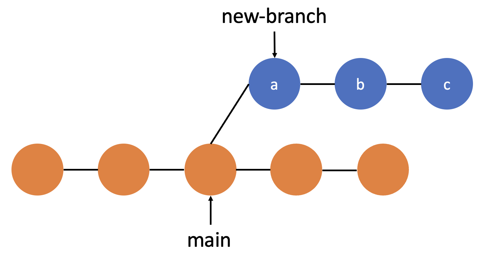
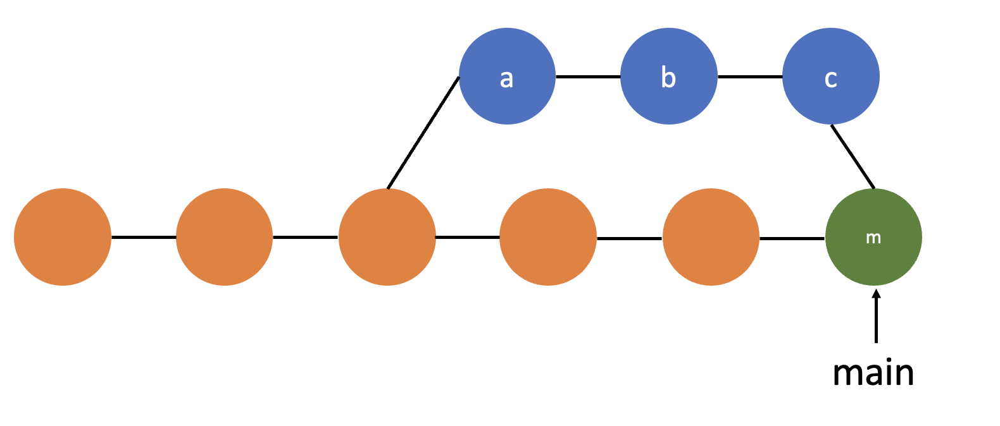
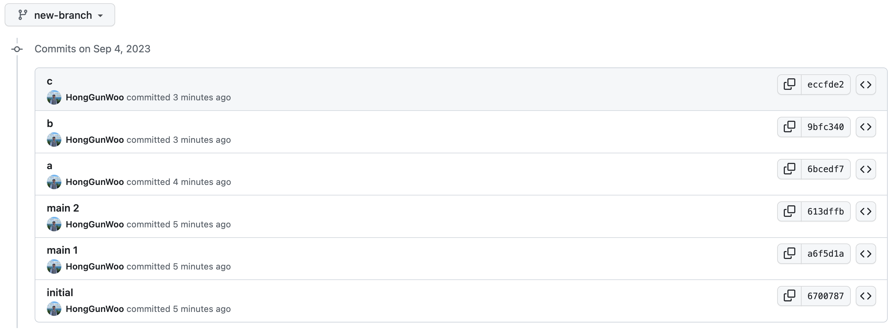
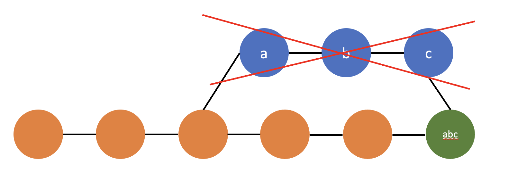
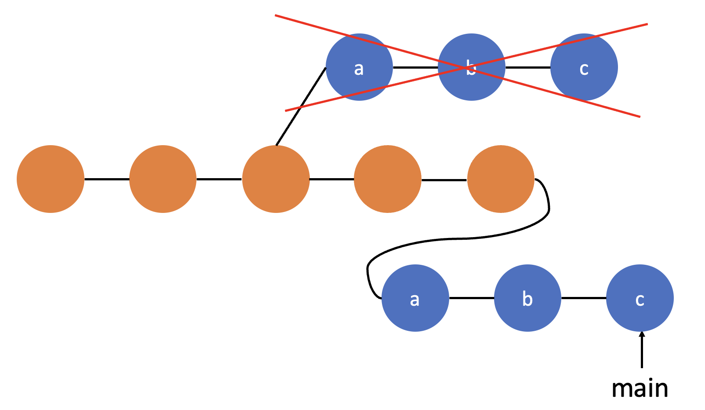

# \***\*Github pull request merge 종류\*\***

Merge pull request를 할려고 할 때 위와 같은 3가지 선택이 있다.

- create a merge commit
- Squash and merge
- Rebase and merge

각 merge 방식은 어떤 차이가 있을까?

그림으로 이해하기 위해 지금 내 git branch 상황은 아래와 같다고 가정해보자!

# Create a merge commit

- 하나의 브랜치와 다른 브랜치의 변경 이력 전체를 합치는 방법
- commit a, b, c를 참조하는 새로운 commit 이력인 m이 생성되고 m을 통해 a + b + c가 main에 추가된다.
- **장점:**
  - 이해하기 쉽고, 역사적인 커밋 히스토리가 유지된다.
  - 브랜치 간의 모든 커밋을 그대로 유지하며 통합한다.
- **단점:**
  - 커밋 히스토리가 복잡해질 수 있다.
  - 불필요한 머지 커밋이 계속 쌓일 수 있다.
- main에 남는 commit ID가 merge한 branch의 commit ID와 같다.
  
  

# Squash and merge

- a, b, c commit을 합쳐서 새로운 commit을 만들고 main에 추가한다.
- feature 브랜치의 commit history를 합쳐서 깔끔하게 만들기 위해 사용한다.
- **장점:**
  - 커밋 히스토리를 깔끔하게 유지할 수 있다.
  - 각 기능 또는 이슈를 하나의 커밋으로 압축하여 관리한다.
- **단점:**
  - 개별 커밋의 정보가 손실될 수 있으며, 디버깅이 어려울 수 있다.
  - 큰 이슈 또는 기능을 작은 커밋으로 나누기 어려울 수 있다.

# Rebase and merge

- 모든 commit들이 합쳐지지 않고 각각 main 브랜치에 추가된다.
  - 기존 커밋들이 새로운 커밋으로 만들어져서 추가되므로 commit ID가 다르다!
- Create a merge commit의 경우 merge commit이 추가로 남게 되지만 rebase의 경우 branch 병합 시 merge commit이 남지않고 하나의 브랜치에서 작업한 것 처럼 보여진다.
- **장점:**
  - 커밋 히스토리를 깔끔하게 유지하며, 브랜치에서 커밋을 리베이스하여 새로운 커밋을 생성한다.
  - 기능 또는 이슈를 단일 브랜치로 결합하여 관리할 수 있다.
- **단점:**
  - 커밋 히스토리가 강제로 변경되므로 주의가 필요하다.
  - 다른 개발자와 협업할 때 주의하지 않으면 충돌이 발생할 수 있다.
